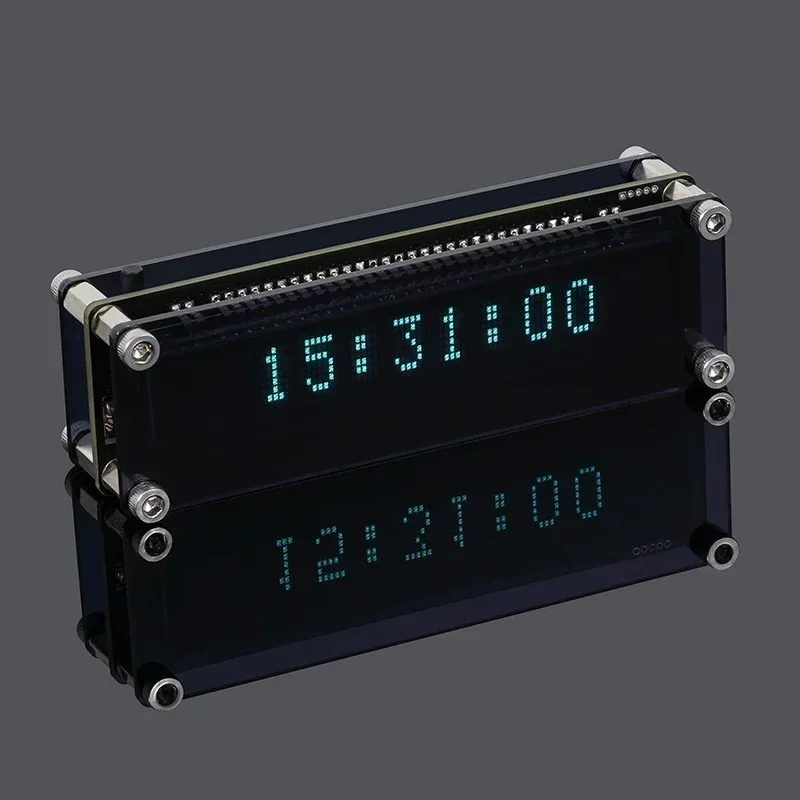

# VFD Clock from AliExpress (Enhanced ESP12 Firmware)



A complete firmware overhaul for the popular USB-powered VFD clocks found on AliExpress. This project transforms a basic clock into a highly optimized, internet-synced timepiece with custom mechanical-style animations and advanced power management.

## Hardware Info
- **VFD Model:** `8-MD-06INKM` (8-digit, 5x7 matrix characters)
- **Microcontroller:** ESP-12F (ESP8266)
- **Interface:** 3-wire Serial (SPI-like)
- **Power:** 5V via USB-C/Micro-USB


## Hardware Reversing

### Backup Original Firmware
Before flashing custom code, it is **highly recommended** to back up the factory "mystery" firmware in case you want to revert or analyze the original logic.

Use `esptool.py` to read the flash (assuming a 4MB flash size):
```bash
# Identify your port first (e.g., COM3 or /dev/ttyUSB0)
esptool.py --port /dev/ttyUSB0 --baud 460800 read_flash 0 0x400000 backup_firmware.bin
# To write it back
# esptool.py --port /dev/ttyUSB0 --baud 460800 write_flash 0 backup_firmware.bin
```


### Pinout (ESP12 to VFD)

Through manual probing with a multimeter, the following pin mapping was identified for the display and input:

|ESP12 Pin|Function|Description|
|---------|--------|-----------|
|GPIO 13  |`CS`    |Chip Select|
|GPIO 12  |`CLK`   |Serial Clock|
|GPIO 14  |`DATA`  |Serial Data|
|GPIO 0   |`BUTTON`|Multi-function Input (Active Low)|
|GPIO 2   |`LED`   |Built-in Blue LED (Sync Indicator)|


### Protocol Analysis (PulseView)

To understand the factory data packets, a Logic Analyzer was used with PulseView.

FIXME: Add in the product bought

- **Sample Rate**: At least **2 MHz** (The VFD clock usually runs around 100-500kHz, so 2MHz provides plenty of headroom).
- **Decoder**: Use the **SPI** decoder.
- **Settings**: * CPOL: 0, CPHA: 0 (Mode 0)
    - **Bit order**: LSB first
    - **Word size**: 8-bit


## PlatformIO Project Capabilities
This firmware isn't just a basic clock; it’s a fully non-blocking "Stealth" OS for your desk.

1. Custom Animation Engine (The "Framebuffer")
Unlike the factory firmware, we utilize the VFD's 8 CGRAM slots as a hardware framebuffer. This allows for:
- **Mechanical Drop-Down**: Digits slide down vertically, mimicking a physical split-flap display.
- **Checkerboard Dissolve**: A sci-fi "shatter" effect where pixels dither between old and new digits.
- **Bidirectional Logic**: The time slides **down** to show the date, and the date slides **up** to return to the time.

2. "Stealth Sync" Technology
To solve the common problem of ESP8266 heat affecting the clock's accuracy:
- **Radio Silence**: WiFi connects on boot to get NTP time, then **powers off completely**.
- **Daily Maintenance**: At 2:00 AM, the radio silently wakes up, re-syncs with an atomic clock, and shuts down again.
- **Heat Reduction**: Keeping the RF radio off 99% of the time keeps the VFD driver and ESP chip cool, extending hardware life.

3. Integrated UI & Menu System
Accessed via a single button (Short press for Date, Long press for Menu):
- **Captive Portal**: Easy WiFi setup via smartphone if no credentials are found.
- **12/24H Toggle**: Seamlessly switch between military and civilian time.
- **DST Toggle**: One-click Daylight Saving adjustment.
- **8-Level Dimmer**: Sub-menu with **Live Preview** to dial in the perfect brightness.
- **Date Peek**: A 3-second temporary date display that resets automatically.

## Installation

1. Open this folder in VS Code with the PlatformIO extension installed.

2. Ensure you have the following libraries (auto-managed by `platformio.ini`):
- `AyresWiFiManager`
- `LittleFS`

3. Connect your clock via USB, hold the Flash button (GPIO 0), and click Upload.

### Note

If the clock boots to `SET WIFI`, connect to the VFD-Clock access point on your phone to enter your local network credentials. The clock will remember these and skip the portal on the next boot!

### WiFi Portal Credentials

- SSID: `VFD-Clock`
- Pass: `12345678`


## Acknowledgements

- [sfxfs/FUTABA-VFD-8-MD-06INKM](https://github.com/sfxfs/FUTABA-VFD-8-MD-06INKM)


